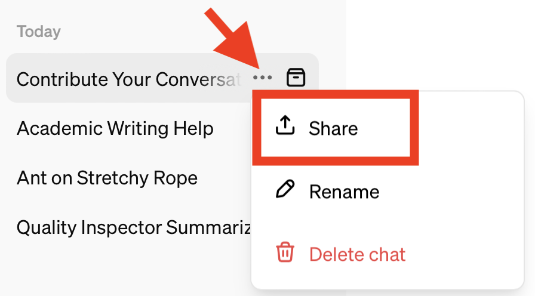
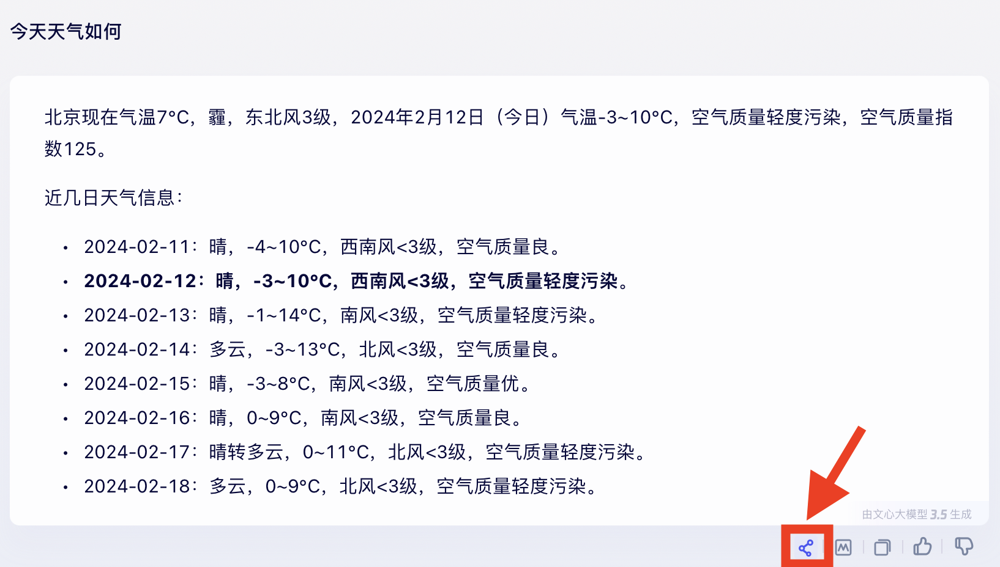

## Contribute Your Conversations

Individual knowledge is limited, the wisdom of the many is infinite!

We are excited to invite you to participate in this user survey, aimed at gathering authentic, diversified, high quality conversations to build a User-Centric Large Language Model Evaluation Benchmark. 

Our dataset hopes to cover a variety of scenarios, including but not limited to

- Objective problems:
  - Solving Professional Problems
  - Retrieving Information
  - Writing Tasks

- Subjective questions:
  - Seeking Creativity
  - Asking for Advice
  - Leisure
- Etc.

For academic research purposes, your questions may be made public, so please try to avoid involving personal information.

Thank you for your participation and contribution!

### How to Participate:

#### Share Method Introduction

- Share Your Conversation Link:

  If your conversation can be shared via a link, we highly recommend submitting this link.
  

- Manually Fill In:

  If you're unable to share a conversation link, you may manually input your questions and the system's responses. 

#### Share Your Experience Here

- **Questionaire**

  🚀 **[English Version](https://www.wjx.cn/vm/Qc5XIm2.aspx# ) | [中文版](https://www.wjx.cn/vm/YKqvOL9.aspx# )** 🚀

- If you have completed the above survey and wish to submit new conversations
  - Download the format file here: [English](https://cloud.tsinghua.edu.cn/f/daca9e76f4b24741b900/) | [中文](https://cloud.tsinghua.edu.cn/f/3f43eb9698f54d8b80b1/)
  - Upload your conversations here: [Upload Your File](https://cloud.tsinghua.edu.cn/u/d/25c5a976d0954656a574/)
