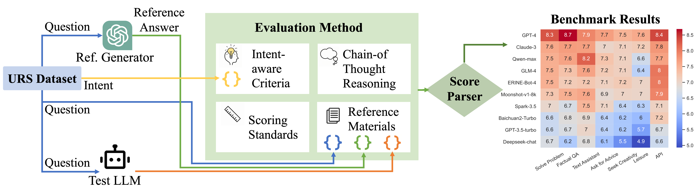

# User-Centric Evaluation of LLMs

Paper: A User-Centric Multi-Intent Benchmark for Evaluating Large Language Models

💡 Currently Call for Contributions

- Introduction: [ENG](Contribution.md) | [中文](Contribution-CN.md)
- Share Your Experience Here: [English Version](https://www.wjx.cn/vm/Qc5XIm2.aspx#) | [中文版](https://www.wjx.cn/vm/e1f1YEA.aspx#)


## Our Highlights

* **User-Centric** 🏄🏻‍♀️🏄🏼🏄🏽‍♂️
  * Dataset
    * Real-world usage scenarios
    * The dataset is collected through a User Survey with 712 participants in 23 countries
  * Evaluation
    * LLMs' efficacy as cooperative services in satisfying user needs
* **Intent-Divided** 🙇🧑‍💻🧑‍🎨🪂
  * System abilities and performances in different scenarios might be different,
  * Users’ expectations across different intents are different,
  * Evaluation criteria for different situations should be different,
  * Therefore we design this benchmark categorized by User Intents.
  * According to related literature, our intent taxonomy is
    * Objective

      * Factual QA, Solve Professional Problem, Text Assistant, Use through APIs
    * Subjective

      * Seek Creativity, Ask for Advice, Leisure
* Multi-Cultural
  * The dataset is contributed by users from 23 countries in Asia, Europe, North America, Oceania, South America, and Africa.
  * Their reported scenarios cover multiple cultural backgrounds


## Benchmark Results

|                    | Solve Problem |  Factual QA | Text Assistant | Ask for Advice | Seek Creativity |     Leisure |         API |         All |
| ------------------ | ------------: | ----------: | -------------: | -------------: | --------------: | ----------: | ----------: | ----------: |
| Cases              |           379 |         259 |             82 |            116 |              86 |          83 |          26 |        1031 |
| GPT-4-0125-preview |         *8.28 |       *8.68 |       **7.91** |          *7.69 |           *7.47 |       *7.57 |       *8.38 |       *8.16 |
| Claude-3-opus      |      **7.61** |    **7.71** |    <u>7.68</u> |           7.01 |     <u>7.10</u> |    **7.16** |        7.77 |    **7.50** |
| Qwen-max           |   <u>7.53</u> | <u>7.64</u> |          *8.20 |       **7.28** |            7.09 |        6.63 |        7.65 | <u>7.48</u> |
| GLM-4              |          7.52 |        7.29 |           7.65 |    <u>7.20</u> |     <u>7.10</u> |        6.37 |    **8.04** |        7.32 |
| ERNIE-Bot-4        |          7.51 |        7.17 |           7.23 |           7.09 |        **7.20** | <u>7.02</u> | <u>8.00</u> |        7.30 |
| Moonshot-v1-8k     |          7.25 |        7.53 |           7.62 |           6.92 |            7.05 |        7.01 |        7.92 |        7.29 |
| Spark-3.5          |          6.97 |        6.70 |           7.45 |           7.05 |            6.44 |        6.33 |        7.08 |        6.86 |
| Baichuan2-Turbo    |          6.55 |        6.83 |           6.91 |           6.35 |            6.17 |        6.02 |        7.19 |        6.57 |
| GPT-3.5-turbo      |          6.55 |        6.73 |           7.01 |           6.35 |            6.17 |        5.69 |        6.73 |        6.51 |
| Deepseek-chat      |          6.74 |        6.24 |           6.83 |           6.09 |            5.52 |        4.93 |        6.58 |        6.29 |

For each intent and the overall scenarios, we mark the three best-performing LLM services, with the first marked ’*’, the second bolded, and the third underlined.

## Dataset

The dataset comes from a user survey with 712 participants in 23 countries.

### Example Cases

Chinese Cases

| Intent                | Description                                                                                                                                                                                                        | Cases                                                                                                                                          | Evaluation Criteria                                                                                                                                                           |
| --------------------- | ------------------------------------------------------------------------------------------------------------------------------------------------------------------------------------------------------------------ | ---------------------------------------------------------------------------------------------------------------------------------------------- | ----------------------------------------------------------------------------------------------------------------------------------------------------------------------------- |
| Solve Problem         | Seek answers or explanations in the field of programming, natural sciences, humanities, social sciences, etc.<br />Address and learn about the profession                                                          | 大模型现在为什么都是decoder-only架构<br />纯流体的粘度测试怎么做<br />烟草花叶病毒属外壳蛋白进入叶绿体的已知机制介绍<br />如何证明费马大定理？ | 1 事实正确性(Factuality),<br />2 满足用户需求(User Satisfaction), <br />3 清晰度(Clarity), <br />4 逻辑连贯性(Logical Coherence), <br />5 完备性(Completeness)                |
| Information Retrieval | Fast and direct access to factual information                                                                                                                                                                      | 大雪农历初几<br />一加仑是多少升<br />西瓜书的目录是什么                                                                                       | 1 事实正确性(Factuality),<br />2 满足用户需求(User Satisfaction), <br />3 清晰度 (Clarity), <br />4 完备性 (Completeness), <br />5 逻辑连贯性(Logical Coherence)              |
| Use through APIs      | Use through Application Programming Interface instead of user interfaces<br />Explore and test the capabilities of LLM, such as evaluating it on various tasks, simulating agents, environments, or datasets, etc. | 大模型CEval评测<br />MBTI测试<br />评价模型生成内容的helpfulness                                                                               | 1 事实正确性(Factuality),<br />2 满足用户需求(User Satisfaction), <br />3 清晰度(Clarity), <br />4 逻辑连贯性(Logical Coherence), <br />5 完备性(Completeness)                |
| Ask for Advice        | Career development, personal counseling, gift recommendation, etc., or creating personal schedules, travel plans, shopping lists, etc.                                                                             | 如何快速提高英语听力能力？<br />哪些有效方式可以缓解失眠症状？<br />适合中老年人的健康监测智能设备推荐                                         | 1 满足用户需求(User Satisfaction),<br />2 事实正确性(Factuality), <br />3 公平与可负责程度(Fairness and Responsibility), <br />4 创造性(Creativity), <br />5 丰富度(Richness) |
| Seek Creativity       | Brainstorming for inspiration, innovative ideas, etc.                                                                                                                                                              | 设计三个生鲜超市slogan<br />我在构思经济学的课题，关于后疫情时代消费者行为变化，给我几个具体的idea<br />如何发财                               | 1 满足用户需求(User Satisfaction),<br />2 逻辑连贯性(Logical Coherence), <br />3 创造性(Creativity), <br />4 丰富度(Richness), <br />5 事实正确性(Factuality)                 |
| Leisure               | Movie and music recommendations, games, and other entertaining activities                                                                                                                                          | 下饭剧推荐<br />分享一个关于程序员的幽默笑话<br />推荐几款好玩的音乐节奏游戏                                                                   | 1 满足用户需求(User Satisfaction),<br />2 趣味性 (Engagement), <br />3 适宜性 (Appropriateness), <br />4 创造性 (Creativity), <br />5 事实正确性 (Factuality)                 |

## Evaluation



- The evaluation criteria for each intent are shown in the table above.
- Details are shown in the paper.

## Citation

- Please cite our [Report](https://jiayinwang.notion.site/User-Centric-Evaluation-of-LLMs-e2fae792b39e43ec81b5428437688720?pvs=4) if you find our work valuable, thank you!

```
@inproceedings{URS,
	title={URS: Evaluating Large Language Models on User Reported Scenarios},
	booktitle={THUIR Blog},
	year={2024}
}
```
